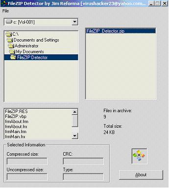



## FileZIP Detector

### Description

This program is able to scan the files contained in a ZIP archive,but it cannot unzip them. http://linuxman.2ya.com/. if you think this is useful do rate it, thanks:)
 
### More Info
 

             |
---                |---
**Submitted On**   |2004-09-16 16:38:08
**By**             |[Jim Reforma](https://github.com/Planet-Source-Code/PSCIndex/blob/master/ByAuthor/jim-reforma.md)
**Level**          |Intermediate
**User Rating**    |4.4 (22 globes from 5 users)
**Compatibility**  |VB 5\.0, VB 6\.0
**Category**       |[Files/ File Controls/ Input/ Output](https://github.com/Planet-Source-Code/PSCIndex/blob/master/ByCategory/files-file-controls-input-output__1-3.md)
**World**          |[Visual Basic](https://github.com/Planet-Source-Code/PSCIndex/blob/master/ByWorld/visual-basic.md)
**Archive File**   |[LinuxMan1794299162004\.zip](https://github.com/Planet-Source-Code/jim-reforma-filezip-detector__1-56204/archive/master.zip)

